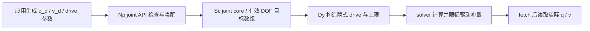

# E2 · 驱动、机器人与任务接口

[首页](../README.md) · [E1 建模与状态](modeling-state-time.md) · [课程路线](curriculum.md) · [验证记录](validation/e2.md)

本章回答三个具体问题：向哪一个原生字段写入控制命令，它怎样形成关节/刚体的运动，以及应用怎样组织机器人任务而不把瞬移或驱动目标当成执行结果。先修是 E1 的 Actor/COM/joint frame、关节 DOF 映射和 `simulate` / `fetchResults` 边界；数学先修为刚体变换、线性代数与基本 PD 控制。

固定源码仍为 `ovphysx-0.6.3` 对应 `da950a3537927784951853c66618036f332ca0ce`，SDK 头文件版本 **5.11.0**。以下讨论 C++ 原生 SDK 的普通 CPU 状态访问路径，未启用 Direct GPU API；Isaac Sim、UniSim、USD/URDF 导入器与 Python 绑定的版本、调度和限幅不能由这些接口推断。本章覆盖 **A3/A5/A7**，提供原生片段、字段/量纲、源码路径和练习；没有运行控制器或物理实验，历史研究结果后续复用 DexLab。

## 1. 四类“让物体动起来”的操作

| 意图 | 原生 API | 写入内容 | 能否把调用成功视为完成控制 |
|---|---|---|---|
| 初始化或指定状态 | `setGlobalPose`、`setLinearVelocity`、`setJointPosition` | 当前位姿/速度/关节状态 | 不能；它直接改变状态，不表示跟踪过程 |
| prescribed motion | `PxRigidDynamic::setKinematicTarget` | 运动学 Actor 下个物理步的世界目标 | 不能；它不是有限执行器能力下的受力跟踪 |
| 施加外部作用 | `addForce`、`addTorque`、`PxRigidBodyExt::addForceAtPos` | 世界空间力/力矩或其他 mode 的输入 | 不能；还要经过积分、约束与碰撞 |
| 关节驱动 | articulation 的 `setDriveParams/Target/Velocity`；D6 的 `setDrive/Position/Velocity` | 由求解器处理的驱动参数与目标 | 不能；限位、限幅、接触与负载会影响实际状态 |

普通动态刚体每帧 `setGlobalPose` 并不是位置伺服；每帧强制 `setLinearVelocity` 会覆盖力对速度的影响。articulation 的 `setJointPosition` 主要用于状态设置，批量修改后需按 E1 调用 `updateKinematic`；它不是 `setDriveTarget` 的快速同义词。[刚体设姿](https://github.com/NVIDIA-Omniverse/PhysX/blob/da950a3537927784951853c66618036f332ca0ce/physx/include/PxRigidActor.h#L76-L106)、[速度覆盖](https://github.com/NVIDIA-Omniverse/PhysX/blob/da950a3537927784951853c66618036f332ca0ce/physx/include/PxRigidDynamic.h#L305-L365)、[joint state 设置](https://github.com/NVIDIA-Omniverse/PhysX/blob/da950a3537927784951853c66618036f332ca0ce/physx/include/PxArticulationJointReducedCoordinate.h#L397-L462)。

运动学目标的多个写入会相互覆盖，调用方应在每个需要移动的物理步提交目标。若将视觉刷新频率直接当 target 更新频率，机器人和显示器刷新率就耦合了。运动学模式有明确使用场景，例如规定运动的平台；不要把它生成的轨迹作为关节驱动已实现的证据。[kinematic 协议](https://github.com/NVIDIA-Omniverse/PhysX/blob/da950a3537927784951853c66618036f332ca0ce/physx/include/PxRigidDynamic.h#L63-L97)。

## 2. 刚体力、冲量、加速度与坐标

### 相同参数类型，四种不同量纲

`PxForceMode` 选择的不是“强弱档位”。在 SI 单位下：

| mode | `addForce` 参数 | `addTorque` 参数 | 独立自由刚体的一阶输入关系 |
|---|---|---|---|
| `eFORCE` | N | N·m | `Δv ≈ h F/m`，角向由世界惯量处理 |
| `eIMPULSE` | N·s | N·m·s | `Δv = J/m`，该输入本身不再乘 h |
| `eACCELERATION` | m/s² | rad/s² | 输入直接加入加速度累加器 |
| `eVELOCITY_CHANGE` | m/s | rad/s | 输入直接加入速度增量累加器 |

这里的自由刚体关系只解释输入换算，不含约束、接触、阻尼和其他力；因此不是完整一步仿真的结果预测。`eFORCE/eIMPULSE` 分别先乘逆质量或世界逆惯量，再进入加速度/速度增量通道；另两种 mode 跳过这次质量换算。[mode 定义](https://github.com/NVIDIA-Omniverse/PhysX/blob/da950a3537927784951853c66618036f332ca0ce/physx/include/PxRigidBody.h#L18-L30)、[实际 switch](https://github.com/NVIDIA-Omniverse/PhysX/blob/da950a3537927784951853c66618036f332ca0ce/physx/source/physx/src/NpRigidBodyTemplate.h#L509-L561)。

例如向 2 kg 的独立刚体施加 10 N 持续 0.01 s，对自由平动的速度贡献为 0.05 m/s。相同作用的冲量是 0.1 N·s；若每个 0.01 s 子步误调用 `addForce(10, eIMPULSE)`，单次速度贡献就是 5 m/s。这是量纲推导，**没有运行实验**。

`addForce` 在质心施加世界方向的输入，不直接产生力矩。要在世界点 P 施加力 F，`addForceAtPos` 将力矩按 `τ=(p_P-p_C)×F` 加入；local/world 不同组合另有明确命名的扩展接口，不能把工具坐标的 F 直接传给世界接口。可以先按当前工具旋转变到世界，位置按完整变换变到世界。[力入口与限制](https://github.com/NVIDIA-Omniverse/PhysX/blob/da950a3537927784951853c66618036f332ca0ce/physx/include/PxRigidBody.h#L503-L538)、[点力接口](https://github.com/NVIDIA-Omniverse/PhysX/blob/da950a3537927784951853c66618036f332ca0ce/physx/include/extensions/PxRigidBodyExt.h#L137-L166)、[计算力矩](https://github.com/NVIDIA-Omniverse/PhysX/blob/da950a3537927784951853c66618036f332ca0ce/physx/source/physxextensions/src/ExtRigidBodyExt.cpp#L374-L387)。

### 累加、保留和 articulation 的差别

`addForce` 是累加，多个控制模块重复施力会相加。普通刚体输入通常在下个物理步应用后清理；`eRETAIN_ACCELERATIONS` 改变跨步保留策略，清理时还要区分加速度与速度增量累加器。控制记录应同时写 mode、frame、单位、是否保留、每子步提交频率，不能只记一个 `force=10`。[刚体清理语义](https://github.com/NVIDIA-Omniverse/PhysX/blob/da950a3537927784951853c66618036f332ca0ce/physx/include/PxRigidBody.h#L510-L527)、[clearForce/clearTorque](https://github.com/NVIDIA-Omniverse/PhysX/blob/da950a3537927784951853c66618036f332ca0ce/physx/include/PxRigidBody.h#L574-L619)。

articulation 的两条通道不要混淆：

- **link 空间输入**：`link.addForce/addTorque` 是 link COM 上的空间作用。API 不允许 articulation link 使用 `eIMPULSE` 或 `eVELOCITY_CHANGE`。不要把父子连杆各自按逆质量更新，冒充整个耦合机器人冲量响应。
- **joint 广义力输入**：`cache.jointForce[i]` 配 `applyCache(..., eFORCE)` 是对应 DOF 的力或力矩；本版文档明确说明它**持续到再次修改**，不是每帧自动清零。终止、切换控制模式或 reset 时必须显式写零/替换。它与 drive 是不同输入，不应无意中叠加两个控制器。

这里 `PxArticulationCacheFlag::eFORCE` 是缓存字段 mask，和 `PxForceMode::eFORCE` 不是同一枚举。[link mode 限制](https://github.com/NVIDIA-Omniverse/PhysX/blob/da950a3537927784951853c66618036f332ca0ce/physx/include/PxRigidBody.h#L515-L521)、[joint force 持续性](https://github.com/NVIDIA-Omniverse/PhysX/blob/da950a3537927784951853c66618036f332ca0ce/physx/include/PxArticulationReducedCoordinate.h#L237-L246)。

普通刚体的实际入口也有条件：`NpRigidDynamic::addForce` 检查在 Scene 中、非 kinematic、simulation 启用以及 CPU API 的使用范围，再调用 `addSpatialForce`，并按规则唤醒。API 名字存在不能证明特定 Actor/阶段允许使用。[入口实现](https://github.com/NVIDIA-Omniverse/PhysX/blob/da950a3537927784951853c66618036f332ca0ce/physx/source/physx/src/NpRigidDynamic.cpp#L289-L314)。

## 3. Reduced-coordinate articulation 的驱动

### 配置、目标、状态分开

对关节轴 `axis`，先在入 Scene 前确定 `setJointType` 和 `setMotion`。要有限位，motion 必须为 `eLIMITED`，再设置 `PxArticulationLimit(low, high)`；只给上下界却保留 `eFREE` 不会启用限位。推荐 `low < high`，锁轴用 `eLOCKED` 和正确 joint frame，不能靠等上下界模拟固定关节。[限制条件](https://github.com/NVIDIA-Omniverse/PhysX/blob/da950a3537927784951853c66618036f332ca0ce/physx/include/PxArticulationJointReducedCoordinate.h#L82-L153)。

| 字段/方法 | 作用与单位 | 应单独记录的内容 |
|---|---|---|
| `setDriveParams(axis, PxArticulationDrive(...))` | stiffness、damping、drive type、力上限/电机包络 | 完整结构内容，不能只记“PD” |
| `setDriveTarget(axis, q_d)` | 平移用场景长度，旋转用 rad | parent joint frame 与轴映射 |
| `setDriveVelocity(axis, v_d)` | 长度/s 或 rad/s | 速度前馈，不是实际速度 |
| `setMaxJointVelocity(axis, v_max)` | 对该轴施加 solver 速度约束 | 不是位置目标变化率限制器 |
| `setArmature(axis, a)` | 加到该轴广义惯量；平移为质量，转动为 ML² | 不等于 motor gear ratio |
| `getJointPosition/getJointVelocity` | 当前状态 | 在正确的步边界读取，与目标比较 |

`setDriveTarget` 的 angular target 根据本版 joint frame 约定形成旋转，不是任意三分量 Euler 角。接口用 `Gp * Lp * J = Gc * Lc` 定义 parent/child 与关节相对运动；球关节目标按 `PxExp` 组合，有最短旋转与角度范围语义。不能把另一库的 RPY 三个数原样写到 twist/swing target。[target 约定](https://github.com/NVIDIA-Omniverse/PhysX/blob/da950a3537927784951853c66618036f332ca0ce/physx/include/PxArticulationJointReducedCoordinate.h#L192-L215)、[速度目标](https://github.com/NVIDIA-Omniverse/PhysX/blob/da950a3537927784951853c66618036f332ca0ce/physx/include/PxArticulationJointReducedCoordinate.h#L230-L248)、[armature](https://github.com/NVIDIA-Omniverse/PhysX/blob/da950a3537927784951853c66618036f332ca0ce/physx/include/PxArticulationJointReducedCoordinate.h#L263-L278)、[每轴速度限制](https://github.com/NVIDIA-Omniverse/PhysX/blob/da950a3537927784951853c66618036f332ca0ce/physx/include/PxArticulationJointReducedCoordinate.h#L369-L384)。

### Force drive 与 acceleration drive

对单个平移或转动 DOF，以 `e=q_d-q`、`e_v=v_d-v` 表示偏差。force drive 的连续弹簧阻尼概念式是 `u=k_p e+k_d e_v`；acceleration drive 用同样的偏差构造期望加速度，然后按系统响应形成驱动作用。PhysX 的原生 drive 是**隐式弹簧阻尼**，不是每步在当前状态算一次上述 u 再调用 `addForce` 的显式 PD。[drive 类型](https://github.com/NVIDIA-Omniverse/PhysX/blob/da950a3537927784951853c66618036f332ca0ce/physx/include/solver/PxSolverDefs.h#L300-L307)、[gain 单位](https://github.com/NVIDIA-Omniverse/PhysX/blob/da950a3537927784951853c66618036f332ca0ce/physx/include/solver/PxSolverDefs.h#L481-L505)。

| drive type | 平移 stiffness / damping | 转动 stiffness / damping |
|---|---|---|
| `eFORCE` | N/m；N/(m/s) | N·m/rad；N·m/(rad/s) |
| `eACCELERATION` | 1/s²；1/s | 1/s²；1/s |

为了理解“隐式”，考虑无接触、无其他力、单自由度有效质量 `m_eff>0`、固定目标和步长 h。若弹簧阻尼在步末速度与 `q_{k+1}=q_k+h v_{k+1}` 上求值，则：

$$
 m_{\mathrm{eff}}(v_{k+1}-v_k)
 =h\{k_p(q_d-q_k-hv_{k+1})+k_d(v_d-v_{k+1})\},
$$

$$
 v_{k+1}=\frac{m_{\mathrm{eff}}v_k+h[k_p(q_d-q_k)+k_dv_d]}
 {m_{\mathrm{eff}}+hk_d+h^2k_p}.
$$

这说明增益、步长和有效质量会共同进入分母；不是声称完整 PhysX 多体/接触系统等于这个一维模型。实际 `computeImplicitDriveParamsForceDrive` 使用 `a=h(h k_p+k_d)`、`x=1/(1+a*unitResponse)`；acceleration 分支使用 `x=1/(1+a)`，并通过 `recipUnitResponse` 处理作用尺度。`unitResponse` 表示冲量到相对速度变化的响应，不能总用某个单独 link 的逆质量替代。两条实现还显式区分 `dt`、`simDt` 和 TGS/PGS 的 bias。[共享驱动实现](https://github.com/NVIDIA-Omniverse/PhysX/blob/da950a3537927784951853c66618036f332ca0ce/physx/source/lowleveldynamics/shared/DyCpuGpuArticulation.h#L77-L153)。

因此将同一组数值从 force drive 复制到 acceleration drive，会改变物理单位和响应。acceleration drive 也仍受力/冲量上限约束；不能据其名字宣称质量完全不影响所有接触运动、也不能保证高增益永不振荡。

### 上限：旧 maxForce 与本版 performance envelope

`PxArticulationDrive::maxForce` 在本基线已标记 deprecated，但仍有效。其上限对两种 drive type 都适用：设置 `PxArticulationFlag::eDRIVE_LIMITS_ARE_FORCES` 时按力/力矩解释，否则按冲量/角冲量解释。该 flag 作用于整个 articulation；不要只按单个关节理解它。不要凭字段名字猜单位，也不要依赖未读回的默认 flag。[上限定义](https://github.com/NVIDIA-Omniverse/PhysX/blob/da950a3537927784951853c66618036f332ca0ce/physx/include/solver/PxSolverDefs.h#L507-L535)。

在未启用新包络的路径中，源码先按 `maxForceScale = flag ? dt : 1` 建立 `driveMaxImpulse`，再将 drive 累积冲量夹在正负上限之间。假设完整物理步 h=0.01 s、平移 drive 上限 20 N，则对应该步的 drive 冲量预算为 0.2 N·s；把同样的 20 设成冲量上限就是另一种参数化。这里说的是 **drive 分支预算**，不是关节传递总力、更不是两指接触法向力的上限。[缩放](https://github.com/NVIDIA-Omniverse/PhysX/blob/da950a3537927784951853c66618036f332ca0ce/physx/source/lowleveldynamics/src/DyFeatherstoneArticulation.cpp#L2830-L2843)、[冲量字段](https://github.com/NVIDIA-Omniverse/PhysX/blob/da950a3537927784951853c66618036f332ca0ce/physx/source/lowleveldynamics/src/DyFeatherstoneArticulation.cpp#L2235-L2250)、[限幅](https://github.com/NVIDIA-Omniverse/PhysX/blob/da950a3537927784951853c66618036f332ca0ce/physx/source/lowleveldynamics/src/DyFeatherstoneArticulation.cpp#L4326-L4334)。

本版 `PxPerformanceEnvelope` 用静态电机能力关系约束 effort E 和轴速度 v：

$$
 |E|\le E_{\max}-r_v|v|,\qquad
 |v|\le v_{\max}-g_E|E|.
$$

平移 E 是 N，转动 E 是 N·m；`r_v` 的单位是 effort/velocity，`g_E` 是 velocity/effort。该结构是静态能力包络，不是包含电流、温度、延迟的完整电机模型。`envelope.maxEffort>0` 时它优先于旧 maxForce；缺省 maxEffort=0 才回退旧上限。包络作用的 effort 包含 drive 与 cache joint effort，源码也把 `externalJointForce * effectiveTimestep` 加进限幅输入；旧 maxForce 分支则只夹 drive。不能把两个路径的“力上限”混成同一保证。[包络定义](https://github.com/NVIDIA-Omniverse/PhysX/blob/da950a3537927784951853c66618036f332ca0ce/physx/include/solver/PxSolverDefs.h#L346-L404)、[优先级](https://github.com/NVIDIA-Omniverse/PhysX/blob/da950a3537927784951853c66618036f332ca0ce/physx/include/solver/PxSolverDefs.h#L522-L535)、[实际合并限幅](https://github.com/NVIDIA-Omniverse/PhysX/blob/da950a3537927784951853c66618036f332ca0ce/physx/source/lowleveldynamics/src/DyFeatherstoneArticulation.cpp#L4300-L4334)。

位置限位、每轴速度限制、drive 上限和 motor envelope 是不同约束。应用还应限制目标变化率并校验有限值；“目标在限位内”不证明每一步实际状态都完全满足理想约束。完整接触耦合、摩擦、迭代误差及力观测由 E3 继续展开。

## 4. 从 setter 到实际执行：一条可追踪的链



| 层 | 固定源码入口 | 读者应核对的事实 |
|---|---|---|
| 公共 API 的实现 | [Np joint setters](https://github.com/NVIDIA-Omniverse/PhysX/blob/da950a3537927784951853c66618036f332ca0ce/physx/source/physx/src/NpArticulationJointReducedCoordinate.cpp#L365-L419) | 目标写入阶段限制、球/转动角范围、autowake 和 Direct GPU API 限制 |
| 中间转发 | [scSetDriveTarget/Velocity](https://github.com/NVIDIA-Omniverse/PhysX/blob/da950a3537927784951853c66618036f332ca0ce/physx/source/physx/src/NpArticulationJointReducedCoordinate.h#L143-L163) | 目标进入 `mCore.setTargetP/V`，不是设当前 joint position |
| 数据映射 | [Sc joint core](https://github.com/NVIDIA-Omniverse/PhysX/blob/da950a3537927784951853c66618036f332ca0ce/physx/source/simulationcontroller/src/ScArticulationJointCore.cpp#L63-L118) | 用 `jointOffset + invDofIds[axis]` 写 low-level target array；有效 DOF 才有槽位 |
| 参数更新 | [setDrive](https://github.com/NVIDIA-Omniverse/PhysX/blob/da950a3537927784951853c66618036f332ca0ce/physx/source/simulationcontroller/src/ScArticulationJointCore.cpp#L234-L245) | 复制参数并标记需更新 |
| 构造约束 | [旋转轴](https://github.com/NVIDIA-Omniverse/PhysX/blob/da950a3537927784951853c66618036f332ca0ce/physx/source/lowleveldynamics/src/DyFeatherstoneArticulation.cpp#L2426-L2445)、[平移轴](https://github.com/NVIDIA-Omniverse/PhysX/blob/da950a3537927784951853c66618036f332ca0ce/physx/source/lowleveldynamics/src/DyFeatherstoneArticulation.cpp#L2503-L2525) | 区分 locked/drive 条件；选择 PGS dt 或 TGS stepDt；准备隐式 drive 描述 |
| 求驱动冲量 | [computeDriveImpulse](https://github.com/NVIDIA-Omniverse/PhysX/blob/da950a3537927784951853c66618036f332ca0ce/physx/source/lowleveldynamics/shared/DyCpuGpuArticulation.h#L181-L192) | 使用当前相对速度、位置增量、已累计冲量和 bias，函数中的局部变量名字不改变返回量的冲量语义 |
| 施加限制并更新 | [drive solve](https://github.com/NVIDIA-Omniverse/PhysX/blob/da950a3537927784951853c66618036f332ca0ce/physx/source/lowleveldynamics/src/DyFeatherstoneArticulation.cpp#L4300-L4334) | 区分 envelope/旧限幅，计算 `driveDeltaF` 后更新相对速度 |

这条链解释“设置目标”怎样变成求解器作用，不替代 E3 的完整碰撞、约束装配和积分追踪。源码 `driveDeltaF` 等名字含 F，也不能直接把它按牛顿打印成传感器力；先查其构造与 timestep。

## 5. 另一类机器人关节：D6 / Revolute extension joints

Reduced-coordinate articulation 适合将树状连杆的相对自由度作为状态。另一种原生建模方式是用 extension joints 约束 Actor，例如 `PxD6Joint` 和 `PxRevoluteJoint`。二者的 API 和数据排列不同，不能复用一个叫“joint target”的数组就假定等价。

| 场景 | 原生接口 | 必须保留的差别 |
|---|---|---|
| D6 控制相对 pose/velocity | `setMotion`、`setDrive`、`setDrivePosition`、`setDriveVelocity` | 目标 pose 和速度表达在 actor[0] 的 constraint frame，不是世界 frame |
| D6 force/acceleration spring | `PxD6JointDrive(kp,kd,limit,isAcceleration)` | forceLimit 是 force 或 impulse，受 `PxConstraintFlag::eDRIVE_LIMITS_ARE_FORCES` 控制，不是 articulation flag |
| D6 angular drive | `setAngularDriveConfig` + swing/twist 或 SLERP drives | 本版要选择匹配的 angular model；SLERP 对应三轴旋转，不能把旧版枚举/默认假定照搬 |
| Revolute velocity motor | `setDriveVelocity`、`setDriveForceLimit`、`eDRIVE_ENABLED` | 原生 velocity motor 不等于 articulation 的 position PD |

来源：[D6 隐式弹簧与模式](https://github.com/NVIDIA-Omniverse/PhysX/blob/da950a3537927784951853c66618036f332ca0ce/physx/include/extensions/PxD6Joint.h#L98-L113)、[drive 结构](https://github.com/NVIDIA-Omniverse/PhysX/blob/da950a3537927784951853c66618036f332ca0ce/physx/include/extensions/PxD6Joint.h#L183-L220)、[相对目标坐标](https://github.com/NVIDIA-Omniverse/PhysX/blob/da950a3537927784951853c66618036f332ca0ce/physx/include/extensions/PxD6Joint.h#L475-L508)、[angular 配置](https://github.com/NVIDIA-Omniverse/PhysX/blob/da950a3537927784951853c66618036f332ca0ce/physx/include/extensions/PxD6Joint.h#L422-L460)、[Revolute motor](https://github.com/NVIDIA-Omniverse/PhysX/blob/da950a3537927784951853c66618036f332ca0ce/physx/include/extensions/PxRevoluteJoint.h#L107-L146)。

D6 在 `setDrive` 中保存参数并 markDirty；constraint prep 根据两侧世界 joint frame 算相对偏差，再创建 drive row。这与 reduced articulation 的 low-level joint target 数组是两条原生路径。[D6 参数保存](https://github.com/NVIDIA-Omniverse/PhysX/blob/da950a3537927784951853c66618036f332ca0ce/physx/source/physxextensions/src/ExtD6Joint.cpp#L227-L243)、[线性 drive row](https://github.com/NVIDIA-Omniverse/PhysX/blob/da950a3537927784951853c66618036f332ca0ce/physx/source/physxextensions/src/ExtD6Joint.cpp#L964-L1003)。本版 constraint flag 也标记了未来迁移意图，但本课按固定源码的现行定义解释，不提前套用“未来总是 force”。[flag](https://github.com/NVIDIA-Omniverse/PhysX/blob/da950a3537927784951853c66618036f332ca0ce/physx/include/PxConstraint.h#L24-L39)。

闭链机构可以在 articulation 树之外使用合适的额外约束，但不能将同一 link 直接写成树的两个父节点。官方 [articulation 示例](https://github.com/NVIDIA-Omniverse/PhysX/blob/da950a3537927784951853c66618036f332ca0ce/physx/snippets/snippetarticulationrc/SnippetArticulation.cpp#L98-L136)展示了 native link/joint frame 与额外 D6 连接的组合。此处仅源码阅读，未运行闭链或验收稳定性。

## 6. 从机器人资产到可控制 DOF 的映射

### 导入后的模型要有一张对照表

原生 SDK 片段接收已经解析的几何、关节和质量属性，不调用一个虚构的 `loadURDF()`。如果应用使用 Isaac Sim/UniSim 或其他导入器，单独记录资产格式/哈希、导入器版本与配置；对下面字段逐项核对。解析成功只说明创建了某种对象，不能证明语义与机器人描述一致。

| 资产/应用信息 | 对应 SDK 信息 | 应保留的检查结果 |
|---|---|---|
| link 名称/稳定 ID、父节点 | `PxArticulationLink` 与 tree parent | 名称不能代替运行时低层索引；缺 link/合并 link 要说明 |
| joint origin 与轴方向 | parent/child local joint frame，`PxArticulationAxis` | 用 frame 旋转对齐 native 轴，不能只复制一个任意轴向量 |
| position 零点、符号、单位 | native q 与应用 q 的映射 | 明确 `q_native = s*q_app + b`；速度为 `s*v_app`，力映射按功率一致性处理 |
| joint type、连续转动 | native FIX/PRISMATIC/REVOLUTE/REVOLUTE_UNWRAPPED/SPHERICAL | continuous 与 wrapped 模型区别；不要给不存在的 DOF 留控制槽 |
| lower/upper、velocity、effort | motion/limit、maxJointVelocity、drive/effort 策略 | 导入器可能省略或转换；应用 effort limit 不是 SDK 自动读取的资产字段 |
| visual/collision/inertial origin | Shape local pose / `CMassLocalPose` / mass-space inertia | 三种 frame 按 E1 分开，几何缩放后核质量惯量 |
| mimic/transmission | 原生 mimic/tendon/应用耦合，或明确未映射 | 不能当作注释丢弃；不同映射可能改变 DOF 或约束 |
| end-effector/tool frame | link Actor frame 内的固定工具变换 | 不应默认工具原点等于 link COM |

若 `q_native=s q_app+b`，保持瞬时功率 `τ_native*v_native = τ_app*v_app` 需要 `τ_app=s τ_native`（标量可逆、无损映射假设）；不要把位置符号修正后忘记力/速度方向。多轴传动应显式使用变换/Jacobian 的对偶映射，不能逐项复制 effort。

构造顺序为：创建 articulation → root 与子 link → Shape 和质量惯量 → joint type/frame/motion/limit → drive/初始 state → 固定/自由基座与自碰撞策略 → 加入 Scene → 读取 low-level link/DOF 映射 → 创建 cache。加入 Scene 时，非 root link 的初始 pose 会按 joint frame 与 joint position 重新计算；不是以 createLink 时给的每个世界 pose 为永久约束。[createLink 约定](https://github.com/NVIDIA-Omniverse/PhysX/blob/da950a3537927784951853c66618036f332ca0ce/physx/include/PxArticulationReducedCoordinate.h#L574-L603)、[低层索引](https://github.com/NVIDIA-Omniverse/PhysX/blob/da950a3537927784951853c66618036f332ca0ce/physx/include/PxArticulationLink.h#L81-L95)。

在本版 mimic API 中，硬约束形式是 `q_A + gearRatio*q_B + offset = 0`。例如资产约定从动量 `q_dep = m*q_src + b`，在同单位标量轴的假设下选择 `A=dep, B=src` 时应映射成 `gearRatio=-m, offset=-b`；不能原样复制 m、b。若使用 compliance，还要记录 naturalFrequency/dampingRatio，其语义不等于 actuator stiffness/damping。[原生 mimic 关系](https://github.com/NVIDIA-Omniverse/PhysX/blob/da950a3537927784951853c66618036f332ca0ce/physx/include/PxArticulationReducedCoordinate.h#L1353-L1377)。

### 名称、link index、joint axis、DOF index 四者分开

E1 已解释广度优先的 low-level link index。应用应在入 Scene 后构造并保存如 `finger_left → link 3 → eX → DOF 2` 的映射，并在结构变化后重建它；这里的数字只是表格格式示例。`jointPosition/Velocity/Force/Target` 按 low-level DOF 排列，不是按资产文本顺序，也不是每个 link 固定占 6 项。需要最大坐标数组与 reduced 数组互转时可查看 `packJointData/unpackJointData`，仍要先理解原生数组契约。[cache 索引](https://github.com/NVIDIA-Omniverse/PhysX/blob/da950a3537927784951853c66618036f332ca0ce/physx/include/PxArticulationReducedCoordinate.h#L201-L215)、[pack/unpack](https://github.com/NVIDIA-Omniverse/PhysX/blob/da950a3537927784951853c66618036f332ca0ce/physx/include/PxArticulationReducedCoordinate.h#L803-L832)。

## 7. FK、Jacobian 与 IK 的责任边界

### 正运动学与工具 frame

对 parent Actor pose `G_p`、两个局部 joint frame `L_p,L_c` 以及当前关节运动 `J(q)`：

$$
 G_c=G_p L_p J(q)L_c^{-1},\qquad T_{W,tool}=G_c T_{c,tool}.
$$

沿树递推得到 FK；球关节的原生参数化要按 SDK 语义处理，不自行换成 Euler 链。查询实际 link global pose 时使用 SDK 已更新的状态。若只为 FK 设置了 joint state，non-cache setter 之后调用 `updateKinematic(ePOSITION)`；无需为“刷新 FK”偷偷推进一个有接触/控制副作用的物理步。[joint frame 关系](https://github.com/NVIDIA-Omniverse/PhysX/blob/da950a3537927784951853c66618036f332ca0ce/physx/include/PxArticulationJointReducedCoordinate.h#L193-L209)、[更新规则](https://github.com/NVIDIA-Omniverse/PhysX/blob/da950a3537927784951853c66618036f332ca0ce/physx/include/PxArticulationReducedCoordinate.h#L365-L374)。

### 原生 dense Jacobian 的行列

`computeDenseJacobian(cache, nRows, nCols)` 将广义速度映射到各 link **COM** 的世界线/角速度。行内次序为 `[vx,vy,vz,wx,wy,wz]`，不是某些空间向量库的角在前；矩阵索引是 `row*nCols+col`。使用返回的实际维度，不把 cache 最大分配大小当有效维度：

| 基座 | 有效行数 | 有效列数 | 目标 link 的六行起点 |
|---|---|---|---|
| fixed-base，N 个 link、n 个 joint DOF | `6*(N-1)` | n | `6*(lowLevelLinkIndex-1)`；root 行被省略 |
| floating-base | `6*N` | `6+n` | `6*lowLevelLinkIndex` |

浮动基座的前 6 列对应根的线/角速度，后面是 joint DOF；给普通固定底座机械臂求 IK 时不能意外把基座列也作为可驱动关节。API 计算应发生在 Scene 中、物理步之外，cache 结构必须兼容；按 `applyCache → commonInit → 计算` 的公开约定准备模型状态。实际 Jacobian 实现也会初始化 common data，这不意味着应用可忽略其他动力学方法的先修。[API 与维度](https://github.com/NVIDIA-Omniverse/PhysX/blob/da950a3537927784951853c66618036f332ca0ce/physx/include/PxArticulationReducedCoordinate.h#L959-L971)、[数据布局](https://github.com/NVIDIA-Omniverse/PhysX/blob/da950a3537927784951853c66618036f332ca0ce/physx/include/PxArticulationReducedCoordinate.h#L124-L133)、[实现](https://github.com/NVIDIA-Omniverse/PhysX/blob/da950a3537927784951853c66618036f332ca0ce/physx/source/lowleveldynamics/src/DyFeatherstoneArticulation.cpp#L3424-L3462)。

工具点不在 COM 时，先做点迁移。世界偏移 `r=p_tool-p_COM`，记叉乘矩阵为 `[r]_×`，则：

$$
 J_{v,tool}=J_{v,COM}-[r]_\times J_\omega,\qquad J_{\omega,tool}=J_\omega.
$$

这来自刚体点速度 `v_tool=v_COM+ω×r`。把 COM Jacobian 当作指尖 Jacobian，会在转动时产生错误位移预测。末端工具 frame 朝向与世界误差表达也要一致。

### SDK 动力学接口不是现成 IK 任务求解器

本章已核对的公共 articulation 接口提供 FK 状态更新、Jacobian、质量矩阵和若干动力学计算；它们没有把“任意机器人到达某个末端位姿”打包成一个这里可调用的通用 `solveIK`。课程不虚构该 API；应用/宿主负责误差定义、数值求解、限位、碰撞可行性、奇异性、步长与收敛判据。

一个**应用侧算法示意**是固定基座、小步局部 IK：取工具位姿误差 `e=[e_p; ℓ e_R]`，其中 `e_R=Log(R_d R^T)` 用世界旋转向量表达，ℓ 为显式选择的长度尺度；对应加权 Jacobian `J̄=[J_v;ℓJ_ω]`。阻尼最小二乘更新可写为：

$$
 \Delta q=\bar J^T(\bar J\bar J^T+\lambda^2 I)^{-1}e.
$$

实施时解线性方程而非显式求逆；平移/旋转关节混合时还需为关节坐标做尺度归一化。限制 `Δq`、检查 q 限位与碰撞、迭代后验证残差。该式不保证全局可达、避障或接触稳定，也不是 PhysX 内置算法。求得 q 后可以变成 `setDriveTarget`，再观察动态跟踪；直接设状态得到的几何解不能替代受力执行。不要在任务真实场景中反复试写 q 又不恢复状态，可使用应用自有 FK 模型或独立工作状态承接求解。

动力学前馈也要核对“具体算了什么”：`computeJointForce` 计算给定关节加速度对应的力，文档明确**不含重力、Coriolis、drive 和阻尼项**；不能把它当作完整 inverse dynamics 一键输出。`computeGravityCompensation`、`computeCoriolisCompensation` 分别提供对应项，`computeMassMatrix` 提供 M。对固定基座、无接触且忽略摩擦/阻尼的教学模型，可以按契约组合 `τ_ff=M(q)q̈_d+c(q,v)+g(q)`；接触任务还需要接触/外力与约束处理，不应把未建模项藏进 gain。[computeJointForce](https://github.com/NVIDIA-Omniverse/PhysX/blob/da950a3537927784951853c66618036f332ca0ce/physx/include/PxArticulationReducedCoordinate.h#L941-L957)、[重力/Coriolis](https://github.com/NVIDIA-Omniverse/PhysX/blob/da950a3537927784951853c66618036f332ca0ce/physx/include/PxArticulationReducedCoordinate.h#L851-L901)、[质量矩阵](https://github.com/NVIDIA-Omniverse/PhysX/blob/da950a3537927784951853c66618036f332ca0ce/physx/include/PxArticulationReducedCoordinate.h#L1013-L1043)。

## 8. 控制频率、回调与任务状态机

### 一次控制周期怎样落到物理步

本章采用整数步计数 k、物理步长 h、控制周期 H=m h：在第 k 次 fetch 完成后读取 `x_k`，必要时计算 `u_k`，在下一次 `simulate(h)` 前提交；每 m 步更新一次上层控制。记录观测步号、命令生成步号和计划生效步号；渲染耗时不是 h，wall time 不是任务保持时间。

持续 articulation target/`jointForce` 与普通刚体一次性力/kinematic target 的保持规则不同。控制器每 H 更新一次，不意味着每种 API 都只在 H 时调用一次：普通刚体保持力时通常在各个 h 重新施加，而本版 cache jointForce 会持续，不能又无意做重复累加。模式切换时明确定义旧 target、旧 effort、积分器和应用滤波状态的清理。

`PxSimulationEventCallback` 是事件接收接口，不是自由改写驱动器的通用 control callback。除 `onAdvance` 外，事件通常在 fetch/flush 时发送；回调内不能修改 SDK 状态或创建/销毁对象。将需要的信息复制到应用缓冲，等 fetch 完成后再决定下步命令。`onAdvance` 在仿真运行中执行，是早期位姿通知，有线程和轻量处理要求，也不能当成任意控制写入窗口。[回调契约](https://github.com/NVIDIA-Omniverse/PhysX/blob/da950a3537927784951853c66618036f332ca0ce/physx/include/PxSimulationEventCallback.h#L806-L823)、[onAdvance](https://github.com/NVIDIA-Omniverse/PhysX/blob/da950a3537927784951853c66618036f332ca0ce/physx/include/PxSimulationEventCallback.h#L910-L931)。

### 应用状态机：接近、闭合、保持、释放

以下是应用层接口设计，**没有声称完成抓取实验**。阈值 ε、超时、保持时长来自具体任务协议，后续复用 DexLab 的冻结配置；这里用符号说明判断条件，不捏造验收数值。观测统一来自完成 fetch 后的同一步，回调数据应保留对象 ID、事件类型及对应步号；“有 contact event”不能自动等于有效双指接触。

| 状态 | 输出给原生控制层 | 转移所需的观测 | 失败/恢复 |
|---|---|---|---|
| 接近 Approach | 有效的末端/关节轨迹目标，手指保持打开 | 工具位置/姿态误差小于阈值并持续规定步数 | 不可达、超时、碰撞违规 → Fault |
| 闭合 Close | 按目标变化率限制逐步闭合，保留 drive/effort 上限 | 指定左右指与目标的有效接触，且对象运动满足任务条件 | 目标到位但无目标接触不算成功；超时 → Fault |
| 保持 Hold | 维持协议要求的姿态/驱动目标 | 连续物理时间达到 T_hold，期间对象漂移/接触条件均满足 | 任一步失稳按协议重置保持计时或 Fault，不能累计零散成功帧 |
| 释放 Release | 按限速回到打开目标，按控制契约清旧 joint effort | 开度达标且目标接触已解除 | 释放超时/异常 → Fault |
| 完成 Done | 明确后续保持/停止策略 | 这是本应用状态机完成，不自动成为研究评分的“抓取成功” | 研究评分仍按 DexLab 的原协议 |
| 故障 Fault | 停止生成新轨迹，按模型/协议进入可控保持或释放；清理持久 effort | 记录原因与最后完整观测 | 显式 reset 后恢复，从初始 phase 开始 |

所谓“停止”不能一概把所有 gain 置零：受重力的机械臂可能因此失去支撑；保留旧高力目标也不一定合适。应用必须为具体模型定义故障输出，这属于控制设计，而不是由物理引擎自动决定。

简化调度伪代码如下；`taskTransition` 是上表的应用逻辑，不是 PhysX API：

```text
fetch 完成且 SDK 无错误
  → 复制本步 q/v、工具/对象状态和已缓冲事件
  → 用同一步的观测更新 task phase、连续保持计数和 timeout
  → 到控制周期时生成下一组合法 q_d/v_d/effort
  → 检查映射、单位、有限值、目标范围与模式切换清理
  → 设置原生 target/force（普通刚体按子步保持规则提交）
  → simulate(h)，fetchResults(true)，推进物理步计数
```

## 9. 最小 C++ 阅读片段

[examples/e2_control_robotics.cpp](../examples/e2_control_robotics.cpp) 用一个平移关节展示：入 Scene 前设置 joint frame/type/motion/limit/drive；运行阶段在 fetch 边界写 target/velocity；按完整 DOF 映射提交持久 joint effort；读取工具的世界位姿并选择 dense Jacobian 的 link 行。代码保留原生类型，没有统一引擎封装、机器人框架、URDF 解析器或训练循环。

示例中的 0–0.04 m、gain 和 20 N 是用于解释字段的候选值，不是任何硬件或任务已验证的参数。它使用本版仍可用的 maxForce 路径以展示 force/impulse flag，并明确设置 envelope 为默认零；使用电机包络时要按第 3 节改配置，不能两套上限混写。代码没有 `main`，调用者负责 SDK 创建、连杆/质量、Scene、映射、cache 生命周期与任务判定。实际静态检查状态见[记录](validation/e2.md)，未链接/运行 SDK。

## 10. 易错点与阅读练习

| 错误 | 原生边界与修正 |
|---|---|
| `setJointPosition` 后“跟踪零误差” | 它直接设状态；用 target + 实际状态误差评估驱动行为 |
| 增益照搬另一模式 | force/acceleration drive 单位不同；implicit/explicit PD 也不同 |
| `maxForce=20` 就当接触力永远≤20 N | 先核 flag、envelope、drive/cache/接触的不同量与采样定义 |
| 关闭阶段不再写 jointForce | 它会持续；模式退出需显式更新/清零 |
| 资产 joint 顺序直接变控制数组 | 用已入 Scene 的 low-level link/axis/DOF 映射 |
| 用 COM Jacobian 控制指尖 | 迁移到工具点，并统一行序、世界 frame 与误差单位 |
| 把 q/v/接触从不同步混起来判定 Hold | 用同一 fetch 边界的观测与物理步号；不要拿渲染帧计时 |
| 在 onContact 回调立即 setDriveTarget | 缓冲事件，fetch 完成后再写控制输入 |

1. m=2 kg、h=0.01 s 时，10 N 持续一步的等价 impulse 和自由平动 Δv 是什么？换成 `eVELOCITY_CHANGE` 时应传哪个量？
2. 对旋转轴，force drive 的 kp/kd 与 acceleration drive 的单位分别是什么？后者是否取消了 maxForce 限制？
3. old maxForce=20、flag 为 forces、h=0.01 s 时 drive 冲量预算多少？若同时给 cache jointForce，能否把 20 当作总传递力的保证？
4. 对 same-unit 标量关节，资产 mimic 为 `q_dep=2*q_src+0.1`，原生 A=dep、B=src 应填什么 gearRatio/offset？
5. 一个 fixed-base articulation 有 5 个 link、4 个 DOF。Jacobian 维度是多少？low-level link 3 从哪一行取 6 行？指尖偏离 COM 时再做什么？
6. `computeJointForce` 是否自动含重力补偿？为何只求到一个合法 IK q 还不能宣称物理机器人完成任务？
7. 关闭控制循环前只停止写 jointForce，有什么问题？onContact 能否立即改写驱动来解决？

<details>
<summary>答案与核对点</summary>

1. J=Fh=0.1 N·s，Δv=J/m=0.05 m/s；velocity-change 输入是 0.05 m/s 的对应世界方向向量。不能再乘一次 h。
2. Force：N·m/rad 与 N·m/(rad/s)；acceleration：1/s² 与 1/s。两类仍受上限；加速度型是目标构造/响应处理方式，不是无限执行器。
3. 0.2 N·s。旧 maxForce 分支限 drive，不代表所有外力、约束反力或接触合力；新 envelope 是另一条显式包含 cache effort 的限幅路径，仍不是抓取力传感器保证。
4. `gearRatio=-2`，`offset=-0.1`。先写原生约束方程核符号，而非照抄资产系数。
5. 24×4；从第 12 行（零起算）取 6 行。用工具偏移将 COM 的线速度 Jacobian 迁移到工具点，角向块保持不变；保持世界 frame 与 linear/angular 行序一致。
6. 不自动含，需根据各方法契约组合重力/Coriolis 等项。IK 是几何求解，还需合法映射、驱动跟踪、接触/碰撞与任务协议条件，设状态不证明执行成功。
7. cache jointForce 会持续，显式清零或替换并处理旧 target/控制器状态。回调内不能直接改 SDK 状态；缓冲事件，完成 fetch 后执行已定义的控制/故障策略。

</details>

## 下一步

E2 合入后重新读取任务依赖，E3 将继续解释接触组合、PGS/TGS 数值、constraint/drive/contact 力观测；E4 完成传感器与渲染后，E5 才具备批量/学习接口的课程先修。本章没有提前交付这些专题或生成新实验证据。
